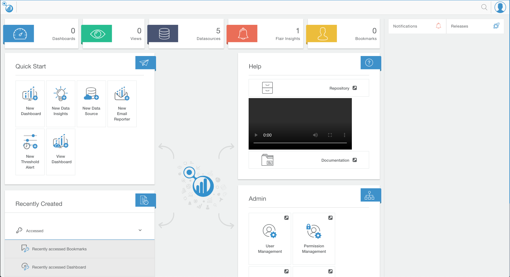

# Flair Helm charts

Helm charts in this repository help you deploy `Flair` in Kubernetes environment. This documemtation takes you though a step-by-step guide to deploying all the services in Kubernetes

> Note: The following instructions have been tested on a GKE cluster and on minikube

## Prerequisites

- [Minikube](https://github.com/kubernetes/minikube)
- [Kubectl](https://kubernetes.io/docs/tasks/tools/install-kubectl/)
- [Helm](https://helm.sh/docs/using_helm/#install-helm)
- [Docker cli](https://docs.docker.com/docker-for-mac/install/)

## Starting Minikube

Once yo have minikube installed, you can go ahead and start a minikube version of Kubernetes.

Note that we are giving minikube 5 CPUs(vCPUs) and 10 Gi of RAM. The verion of Kubernetes we are usign is `1.14.2`

```sh
minikube start --cpus 5 --memory 10240 --kubernetes-version=v1.14.2 --profile flair
```

Once minikube is up and running, please go ahead and initialize the tiller pod necessary for helm

```sh
helm init
```

This might take a few minuites for the tiller pod to be available to take any command.

If you are looking to build docker images from flair's source repositories, you would have to run the following command to point to minikubes docker demon

```sh
eval $(minikube docker-env)
```

> Note: The recommonded way however is to use Vizcentric published docker images in Docker registry.

## Deploying Flair Services

Since we now have the prerequisites necessary for us to deploy flair services sorted, we can go ahead and deploy the services in Kubernetes. Please stick to the order as mentioned below.

Pull down all necessary images for deployment

```sh
docker pull flairbi/flair-registry:v5.0.3
docker pull flairbi/flair-engine:v2.4.0
docker pull flairbi/flair-cache:v2.2.2-SNAPSHOT.2f59747
docker pull flairbi/flair-notifications:2.4.1
docker pull couchdb:2.3.1
docker pull flairbi/flairbi:v2.4.1-SNAPSHOT.eb12f144
```

### Repository and environment setup

Clone this repository and `cd` into the folder

```sh
git clone https://github.com/viz-centric/flair-helm-charts.git
cd flair-helm-charts
```

You can follow along with these step-by-step installation or optionally you can also install all the services through the `setup.sh` script which does everything for you. You can then skip the following steps and go onto [Accessing Flair in Kubernetes]() section.

```sh
./setup.sh
```

If not, you can follow on with the next steps

Create a namespace into which we are going to deploy all Flair services

```sh
kubectl create namespace flair
```

> Note: We will be using this namespace to deploy all our services into. It would be easy to use `kubens flair` so that your default namespace is changed to `flair` and simplifies yoour commands.

### Flair Registry

Flair Registry is used for distributing configuration to all the services and hence the first service which goes in. You can install the flair registry chart by running the following command.

```sh
helm upgrade \
    --install \
    --wait \
    --namespace flair \
    flair-registry ./flair-registry
```

### Flair Engine

Once you have Flair Registry up and running we can go ahead with deploying flair engine. For us to do so, we would have to deploy Postgres first as it is the state store for this service.

#### Postgres
```sh
helm upgrade \
    --install \
    --wait \
    --namespace flair \
    --values ./flair-postgres/flair-engine.yaml \
    flair-engine-pg stable/postgresql
```

> Note: When deploying Flair in production, its recommonded to run postgres outside kubernetes. For example in Public clouds you can make use of cloud provideres offering for Postgres 9.4+. Make sure you make changes to the configuration to point to postgres accordingly.

You can now deploy Flair Engine by running the following command.

```sh
helm upgrade \
    --install \
    --wait \
    --namespace flair \
    flair-engine ./flair-engine
```

### Flair Cache

You can now deploy Flair Cache

```sh
helm upgrade \
    --install \
    --wait \
    --namespace flair \
    flair-cache ./flair-cache
```

### Flair Notifications

Once you have Flair Cache up and running we can go ahead with deploying flair notifications service. For us to do so, we would have to deploy Postgres first as it is the state store for this service.

#### Postgres
```sh
helm upgrade \
    --install \
    --wait \
    --namespace flair \
    --values ./flair-postgres/flair-notifications.yaml \
    flair-notifications-pg stable/postgresql
```

> Note: When deploying Flair in production, its recommonded to run postgres outside kubernetes. For example in Public clouds you can make use of cloud provideres offering for Postgres 9.4+. Make sure you make changes to the configuration to point to postgres accordingly.

You can now deploy Flair Notifications by running the following command.

```sh
helm upgrade \
    --install \
    --wait \
    --namespace flair \
    flair-notifications ./flair-notifications
```

### Flair BI

For you to install flair bi you will need a postgres database and CouchDB where data is persisted. We can start by installing both of those first

#### Postgres
```sh
helm upgrade \
    --install \
    --wait \
    --namespace flair \
    --values ./flair-postgres/flair-bi.yaml \
    flair-bi-pg stable/postgresql
```

> Note: When deploying Flair in production, its recommonded to run postgres outside kubernetes. For example in Public clouds you can make use of cloud provideres offering for Postgres 9.4+. Make sure you make changes to the configuration to point to postgres accordingly.

#### CouchDB

```sh
helm upgrade \
    --install \
    --wait \
    --namespace flair \
    --values ./flair-couchdb/values.yaml \
    flair-couchdb ./flair-couchdb/couchdb
```

Once postgres and couchdb are sucessfully deployed, go ahead and deploy flair bi

```sh
helm upgrade \
    --install \
    --wait \
    --namespace flair flair-bi ./flair-bi
```

## Flair with ISTIO Service-Mesh

### Get Istio

```sh
curl -L https://git.io/getLatestIstio | ISTIO_VERSION=1.3.1 sh -
cd istio-1.3.1
export PATH=$PWD/bin:$PATH
```

### Install CRDs
```sh
for i in install/kubernetes/helm/istio-init/files/crd*yaml; do kubectl apply -f $i; done
```

### Setup Istio
```sh
# For permissive multual TLS
kubectl apply -f install/kubernetes/istio-demo.yaml
```

### Enable mTLS and deploy Flair

```sh
./secure-mesh.sh
# Wait until all services are up and running
# aws-athena-query-results-689779572241-eu-west-2
```

### Sniffing traffic from FLAIRBI to FLAIRENGINE
```sh
kubectl exec -it <ANY_FLAIRBI_POD> -c istio-proxy
ifconfig
sudo tcpdump -vvvv -A -nn -i eth0 '(dst port 6565)'
```

## Accessing Flair in Kubernetes

Once all the services are up and running you can access Flair BI to start visualizing data.

### In Minikube

You can now port forward the Flair BI's service onto to your machine by running the following command

```sh
kubectl port-forward svc/flair-bi 8002:8002
```

### In production

In production we would recommand using public cloud providers load balancer annotation to provision a load balancer for Flair BI alone and create an Alias record (A) in the DNS service pointing at the load balancer. Flair will then be available for your users though the configured DNS name.



## Clean UP

You can delete all the services by running the `clean_up.sh` script to delete all flair services and remove the created namespace.

```sh
./clean_up.sh
```

`or`

You can manually delete all the services in the cluster by running the following commands

```sh
# Removing all services
helm delete flair-bi --purge
helm delete flair-bi-pg --purge
helm delete flair-couchdb --purge
helm delete flair-notifications-pg --purge
helm delete flair-notifications --purge
helm delete flair-cache --purge
helm delete flair-engine --purge
helm delete flair-engine-pg --purge
helm delete flair-registry --purge
# Removing the namesapce
kubectl delete namespace flair
```

If you have ran all of this in minikube, you can also delete the minikube vm by running

```sh
minikube stop --profile flair
minikube delete --profile flair
```

## Roadmap

### New Services

* Flair Operator

> Note: If you are planning to deploy flair in any other way, please let us know and we can help you out developing and deploying it.
